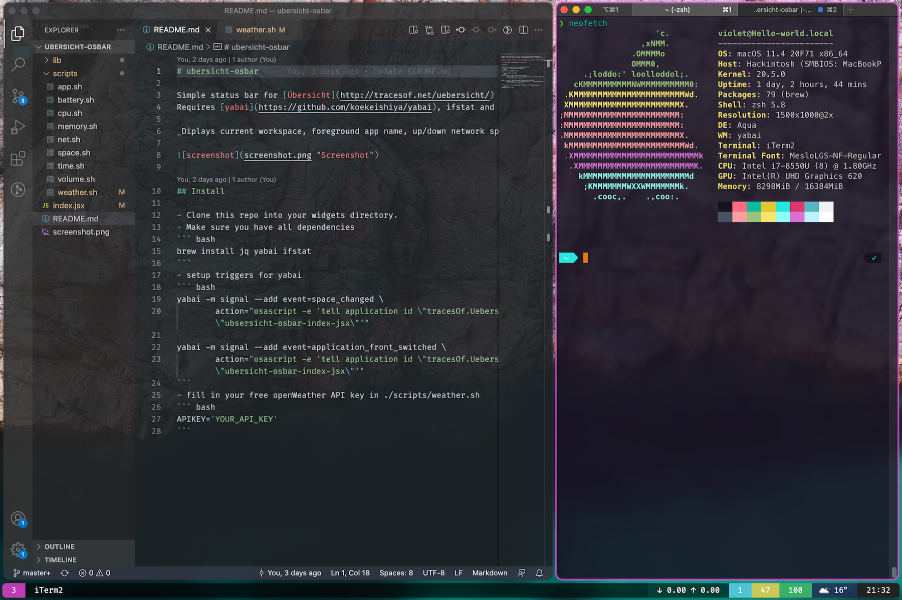

# ubersicht-osbar

Simple status bar for [Übersicht](http://tracesof.net/uebersicht/)  
Requires [yabai](https://github.com/koekeishiya/yabai), ifstat and jq (brew install ifstat/jq).
  
_Diplays current workspace, foreground app name, up/down network speeds, CPU, MEMORY, BATTERY, weather & current time_
  


## Install

- Clone this repo into your widgets directory.
- Make sure you have all dependencies
``` bash
brew install jq yabai ifstat
```
- setup triggers for yabai
``` bash
yabai -m signal --add event=space_changed \
        action="osascript -e 'tell application id \"tracesOf.Uebersicht\" to refresh widget id \"ubsersicht-osbar-index-jsx\"'"

yabai -m signal --add event=application_front_switched \
        action="osascript -e 'tell application id \"tracesOf.Uebersicht\" to refresh widget id \"ubersicht-osbar-index-jsx\"'"
```
- fill in your free openWeather API key in ./scripts/weather.sh
``` bash
APIKEY='YOUR_API_KEY'
```